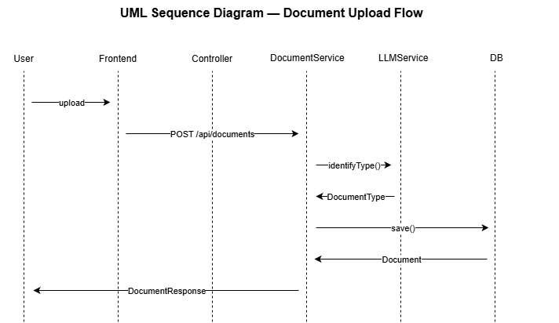
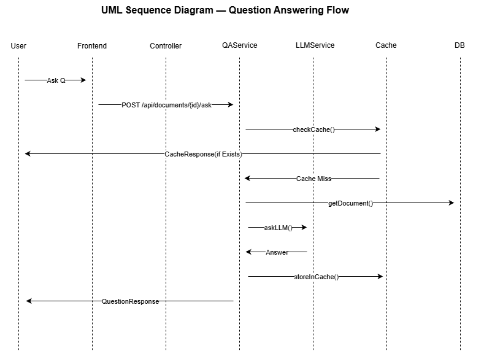

# AI-Powered Knowledge Hub

A comprehensive knowledge repository management system with AI-powered document classification and question-answering capabilities. The system allows users to upload documents, automatically classify them using LLM, and ask questions about document content.

## Table of Contents

1. [System Architecture](#system-architecture)
2. [System UML Diagram](#system-uml-diagram)
3. [OOP Principles Implementation](#oop-principles-implementation)
4. [LLM Integration](#llm-integration)
5. [AI-Assisted Development](#ai-assisted-development)

---

## System Architecture

### Overview

The AI-Powered Knowledge Hub follows a **layered architecture** pattern with clear separation of concerns:

```
┌─────────────────────────────────────────────────────────────┐
│                      Frontend (React)                       │
│  ┌──────────┐  ┌──────────┐  ┌──────────┐  ┌──────────┐ │
│  │ Document │  │ Question │  │   User   │  │  Navbar  │ │
│  │  Upload  │  │  Answer  │  │Management│  │          │ │
│  └──────────┘  └──────────┘  └──────────┘  └──────────┘ │
└─────────────────────────────────────────────────────────────┘
                            │
                    HTTP/REST API
                            │
┌─────────────────────────────────────────────────────────────┐
│                   Backend (Spring Boot)                     │
│  ┌──────────────────────────────────────────────────────┐  │
│  │              Controller Layer                         │  │
│  │  DocumentController │ UserController                  │  │
│  └──────────────────────────────────────────────────────┘  │
│                            │                                │
│  ┌──────────────────────────────────────────────────────┐  │
│  │              Service Layer                            │  │
│  │  DocumentService │ UserService │ DocumentQAService   │  │
│  └──────────────────────────────────────────────────────┘  │
│                            │                                │
│  ┌──────────────────────────────────────────────────────┐  │
│  │              LLM Integration Layer                     │  │
│  │  OpenAIService │ MockLLMService │ LLMServiceFactory  │  │
│  └──────────────────────────────────────────────────────┘  │
│                            │                                │
│  ┌──────────────────────────────────────────────────────┐  │
│  │              Security Layer (AOP)                     │  │
│  │  RoleAspect │ RoleValidationService                   │  │
│  └──────────────────────────────────────────────────────┘  │
│                            │                                │
│  ┌──────────────────────────────────────────────────────┐  │
│  │              Data Access Layer                        │  │
│  │  DocumentRepository │ UserRepository                 │  │
│  └──────────────────────────────────────────────────────┘  │
│                            │                                │
│  ┌──────────────────────────────────────────────────────┐  │
│  │              Data Layer (H2 Database)                 │  │
│  └──────────────────────────────────────────────────────┘  │
└─────────────────────────────────────────────────────────────┘
```

### Architecture Layers

#### 1. **Presentation Layer (Frontend)**
- **React.js** application with component-based architecture
- **Context API** for state management
- **Axios** for HTTP communication
- **React Router** for navigation

#### 2. **Controller Layer**
- RESTful API endpoints
- Request/Response DTOs
- Input validation
- Exception handling

#### 3. **Service Layer**
- Business logic implementation
- Transaction management
- Cross-cutting concerns (caching, logging)

#### 4. **LLM Integration Layer**
- Strategy Pattern for multiple LLM providers
- Factory Pattern for service selection
- Prompt building and response parsing

#### 5. **Security Layer (AOP)**
- Aspect-Oriented Programming for role-based access control
- Centralized security checks
- Header-based authentication

#### 6. **Data Access Layer**
- Spring Data JPA repositories
- Entity mapping
- Database abstraction

#### 7. **Data Layer**
- H2 in-memory database
- Entity relationships
- Data persistence

---

## System UML Diagram

### Class Diagram

```
┌─────────────────────────────────────────────────────────────────────────────┐
│                           Controllers Layer                                  │
├─────────────────────────────────────────────────────────────────────────────┤
│                                                                              │
│  ┌──────────────────────────┐      ┌──────────────────────────┐            │
│  │   DocumentController     │      │     UserController       │            │
│  ├──────────────────────────┤      ├──────────────────────────┤            │
│  │ -documentService         │      │ -userService             │            │
│  │ -contentTypeService      │      ├──────────────────────────┤            │
│  │ -documentQAService       │      │ +getAllUsers()           │            │
│  ├──────────────────────────┤      │ +createUser()            │            │
│  │ +getAllDocuments()       │      │ +updateUserRole()        │            │
│  │ +uploadDocument()        │      └──────────────────────────┘            │
│  │ +viewDocument()          │                                               │
│  │ +deleteDocument()        │                                               │
│  │ +askQuestion()           │                                               │
│  └──────────────────────────┘                                               │
└─────────────────────────────────────────────────────────────────────────────┘
                            │                    │
                            │                    │
                            ▼                    ▼
┌─────────────────────────────────────────────────────────────────────────────┐
│                            Services Layer                                    │
├─────────────────────────────────────────────────────────────────────────────┤
│                                                                              │
│  ┌──────────────────────────┐      ┌──────────────────────────┐            │
│  │   DocumentService         │      │      UserService         │            │
│  │  implements              │      │  implements              │            │
│  │  DocumentServiceInterface│      │  UserServiceInterface    │            │
│  ├──────────────────────────┤      ├──────────────────────────┤            │
│  │ -documentRepository      │      │ -userRepository          │            │
│  │ -documentMapper          │      │ -userMapper               │            │
│  │ -fileStorageService      │      ├──────────────────────────┤            │
│  │ -contentExtractionService│      │ +getAllUsers()           │            │
│  ├──────────────────────────┤      │ +createUser()            │            │
│  │ +getAllDocuments()        │      │ +updateUserRole()        │            │
│  │ +uploadDocument()         │      └──────────────────────────┘            │
│  │ +getDocumentById()        │                                               │
│  │ +downloadDocument()       │                                               │
│  │ +deleteDocument()         │                                               │
│  └──────────────────────────┘                                               │
│                            │                                                 │
│  ┌──────────────────────────┐                                               │
│  │    DocumentQAService      │                                               │
│  ├──────────────────────────┤                                               │
│  │ -documentService          │                                               │
│  │ -llmService              │                                               │
│  ├──────────────────────────┤                                               │
│  │ +answerQuestion()        │                                               │
│  └──────────────────────────┘                                               │
└─────────────────────────────────────────────────────────────────────────────┘
                            │                    │                    │
                            │                    │                    │
                            ▼                    ▼                    ▼
┌─────────────────────────────────────────────────────────────────────────────┐
│                        LLM Integration Layer                                 │
├─────────────────────────────────────────────────────────────────────────────┤
│                                                                              │
│  ┌──────────────────────────┐      ┌──────────────────────────┐            │
│  │   LLMServiceInterface    │      │     OpenAIService        │            │
│  │      <<interface>>        │      │  implements              │            │
│  ├──────────────────────────┤      │  LLMServiceInterface      │            │
│  │ +identifyDocumentType()  │      ├──────────────────────────┤            │
│  │ +answerQuestion()        │      │ -openAIClient            │            │
│  └──────────────────────────┘      │ -requestBuilder          │            │
│            ▲                        │ -responseParser           │            │
│            │                        ├──────────────────────────┤            │
│            │                        │ +identifyDocumentType()  │            │
│            │                        │ +answerQuestion()        │            │
│            │                        └──────────────────────────┘            │
│            │                                                                 │
│  ┌─────────┴──────────────────────────┐                                    │
│  │      MockLLMService                 │                                    │
│  │  implements LLMServiceInterface    │                                    │
│  └─────────────────────────────────────┘                                    │
└─────────────────────────────────────────────────────────────────────────────┘
                            │
                            ▼
┌─────────────────────────────────────────────────────────────────────────────┐
│                        Data Access Layer                                    │
├─────────────────────────────────────────────────────────────────────────────┤
│                                                                              │
│  ┌──────────────────────────┐      ┌──────────────────────────┐            │
│  │  DocumentRepository       │      │    UserRepository        │            │
│  │      <<interface>>         │      │      <<interface>>        │            │
│  ├──────────────────────────┤      ├──────────────────────────┤            │
│  │ +findAll()                │      │ +findAll()               │            │
│  │ +findById()               │      │ +findById()              │            │
│  │ +save()                   │      │ +save()                  │            │
│  │ +deleteById()             │      │ +existsByName()          │            │
│  │ +existsByName()           │      └──────────────────────────┘            │
│  └──────────────────────────┘                    │                         │
│            │                                      │                         │
│            └──────────────────┬──────────────────┘                         │
│                               ▼                                             │
│  ┌──────────────────────────────────────────────────────────┐              │
│  │                      Entities                             │              │
│  ├──────────────────────────┬───────────────────────────────┤              │
│  │       Document            │           User                │              │
│  ├──────────────────────────┤      ├────────────────────────┤              │
│  │ -Long id                 │      │ -Long id                │              │
│  │ -String name             │      │ -String name            │              │
│  │ -DocumentType type       │      │ -UserRole role          │              │
│  │ -String fileName         │      └────────────────────────┘              │
│  │ -String filePath         │                                               │
│  │ -String uploadedBy       │                                               │
│  │ -LocalDateTime uploadDate│                                               │
│  └──────────────────────────┘                                               │
└─────────────────────────────────────────────────────────────────────────────┘
                            │
                            ▼
┌─────────────────────────────────────────────────────────────────────────────┐
│                      Supporting Services                                    │
├─────────────────────────────────────────────────────────────────────────────┤
│                                                                              │
│  ┌──────────────────────────┐  ┌──────────────────────────┐              │
│  │  FileStorageService       │  │ DocumentContentExtraction │              │
│  ├──────────────────────────┤  │        Service            │              │
│  │ +storeFile()             │  ├──────────────────────────┤              │
│  │ +loadFileAsResource()    │  │ +extractContent()        │              │
│  │ +deleteFile()            │  └──────────────────────────┘              │
│  └──────────────────────────┘                                               │
│                                                                              │
│  ┌──────────────────────────┐  ┌──────────────────────────┐              │
│  │      RoleAspect          │  │  RoleValidationService    │              │
│  ├──────────────────────────┤  ├──────────────────────────┤              │
│  │ -roleValidationService   │  │ -requestContextService   │              │
│  ├──────────────────────────┤  ├──────────────────────────┤              │
│  │ +validateRole()          │  │ +validateRole()          │              │
│  └──────────────────────────┘  └──────────────────────────┘              │
│                                                                              │
│  ┌──────────────────────────┐                                               │
│  │  GlobalExceptionHandler  │                                               │
│  ├──────────────────────────┤                                               │
│  │ +handleNotFoundException()│                                              │
│  │ +handleDocumentException()│                                              │
│  │ +handleSecurityException()│                                              │
│  └──────────────────────────┘                                               │
└─────────────────────────────────────────────────────────────────────────────┘
```

### Sequence Diagrams





## OOP Principles Implementation

### 1. Single Responsibility Principle (SRP)

Each class has a single, well-defined responsibility:

- **`DocumentService`**: Handles document CRUD operations
- **`DocumentQAService`**: Handles question-answering logic
- **`DocumentContentExtractionService`**: Extracts text from various file formats
- **`RoleValidationService`**: Validates user roles
- **`RequestContextService`**: Retrieves HTTP request context
- **`DocumentTypePromptBuilder`**: Builds prompts for document type identification
- **`QuestionAnswerPromptBuilder`**: Builds prompts for Q&A

### 2. Open/Closed Principle (OCP)

Classes are open for extension but closed for modification:

- **`LLMServiceInterface`**: Can add new LLM providers without modifying existing code
- **`GlobalExceptionHandler`**: Extended by domain-specific handlers (`DocumentExceptionHandler`, `SecurityExceptionHandler`)
- **`DocumentType` enum**: Can add new document types without changing classification logic

### 3. Liskov Substitution Principle (LSP)

Subtypes must be substitutable for their base types:

- **`OpenAIService`** and **`MockLLMService`** can be used interchangeably via `LLMServiceInterface`
- Exception handlers properly extend `GlobalExceptionHandler`
- All services implement their interfaces correctly

### 4. Interface Segregation Principle (ISP)

Interfaces are focused and not bloated:

- **`LLMServiceInterface`**: Contains only methods needed for LLM operations
- **`DocumentServiceInterface`**: Contains only document-related operations
- **`UserServiceInterface`**: Contains only user-related operations

### 5. Dependency Inversion Principle (DIP)

High-level modules depend on abstractions, not concrete implementations:

- **`DocumentQAService`** depends on `LLMServiceInterface`, not concrete implementations
- **`RoleAspect`** depends on service abstractions (`RequestContextService`, `RoleValidationService`)
- **`LLMServiceFactory`** depends on `LLMServiceInterface`

### Additional OOP Concepts

#### Encapsulation
- Private fields with public getters/setters (via Lombok)
- Internal implementation details hidden from clients
- Constants encapsulated within classes

#### Abstraction
- Interfaces define contracts without implementation details
- Abstract classes provide common functionality
- Services abstract complex operations

#### Polymorphism
- **Strategy Pattern**: Different LLM services implement the same interface
- **Factory Pattern**: `LLMServiceFactory` creates appropriate service instances
- Method overriding in exception handlers

#### Composition over Inheritance
- Services composed of multiple specialized components
- `RoleAspect` composed of `RequestContextService` and `RoleValidationService`
- Better flexibility and testability

---

## LLM Integration

### Architecture Overview

The LLM integration follows a **Strategy Pattern** with **Factory Pattern** for service selection:

```
┌─────────────────────────────────────────────────────────────┐
│                    LLM Integration Layer                     │
├─────────────────────────────────────────────────────────────┤
│                                                              │
│  ┌──────────────────────────────────────────────────────┐  │
│  │              LLMServiceFactory                         │  │
│  │  - Selects provider based on configuration            │  │
│  │  - Returns appropriate LLMServiceInterface            │  │
│  └──────────────────────────────────────────────────────┘  │
│                    │                                         │
│        ┌───────────┴───────────┐                            │
│        │                       │                            │
│  ┌─────▼─────┐         ┌───────▼──────┐                    │
│  │ OpenAI    │         │ Mock          │                    │
│  │ Service   │         │ LLM Service   │                    │
│  └─────┬─────┘         └───────┬──────┘                    │
│        │                       │                            │
│        └───────────┬───────────┘                            │
│                    │                                         │
│            ┌───────▼───────┐                                │
│            │ LLMService     │                                │
│            │ Interface      │                                │
│            └────────────────┘                                │
└─────────────────────────────────────────────────────────────┘
```

### Components

#### 1. **LLMServiceInterface**
Defines the contract for LLM operations:
- `identifyDocumentType()`: Classifies documents into POLICY, REPORT, MANUAL, or UNDEFINED
- `answerQuestion()`: Answers questions about document content

#### 2. **OpenAIService**
Real implementation using OpenAI API:
- **Prompt Builders**: `DocumentTypePromptBuilder`, `QuestionAnswerPromptBuilder`
- **Request Builder**: `OpenAIRequestBuilder` - constructs API requests
- **Response Parser**: `OpenAIResponseParser` - parses API responses
- **Client**: `OpenAIClient` - handles HTTP communication

#### 3. **MockLLMService**
Development/testing implementation:
- Keyword-based document type identification
- Mock responses for question answering
- No API key required

#### 4. **LLMServiceFactory**
Factory for selecting the appropriate service:
- Reads configuration from `application.yml`
- Returns `OpenAIService` or `MockLLMService` based on `llm.provider`

### Document Type Identification

**Process:**
1. User uploads a document
2. `DocumentContentExtractionService` extracts text content
3. `DocumentTypeIdentificationService` calls LLM service
4. LLM analyzes filename and content preview
5. Returns: `POLICY`, `REPORT`, `MANUAL`, or `UNDEFINED`

**Prompt Structure:**
- Clear task definition
- Category definitions with examples
- Classification criteria
- Document information (filename + content preview)
- Output instruction (single category name)

### Question Answering

**Process:**
1. User asks a question about a document
2. `DocumentQAService` retrieves document and extracts content
3. Builds document context (title + content)
4. Calls LLM service with question and context
5. LLM generates answer based on document content
6. Response is cached for similar questions

**Document-Type-Specific Behavior:**
- **POLICY**: Answers focus on sections and headers
- **REPORT**: Answers include summaries and data points
- **MANUAL**: Answers include practical steps and procedures
- **UNDEFINED**: Standard Q&A behavior

**Caching Strategy:**
- Spring Cache with Caffeine (in-memory)
- Cache key: Normalized question + document ID
- TTL: 24 hours
- Cache eviction on document deletion

### Configuration

**application.yml:**
```yaml
llm:
  provider: openai  # or "mock"
  openai:
    api:
      key: "your-api-key-here"
```

**OpenAI Configuration (`OpenAIConfig.java`):**
- API URL: `https://api.openai.com/v1/chat/completions`
- Model: `gpt-5.1`
- Temperature: 0.3 (type identification), 0.7 (Q&A)
- Max tokens: 50 (type identification), 500 (Q&A)

---

## AI-Assisted Development

This project demonstrates a collaborative approach between manual development and AI assistance, where core architecture and business logic were designed manually, while AI assisted with code quality improvements, UI implementation, and documentation.

### Manual Development

The following components were designed and implemented manually:

#### Architecture & Design
- **Project Structure**: Created the complete project structure with domain-driven design approach, organized into domain packages (document, user, security, llm)
- **Domain-Driven Design**: Organized code into domain packages (document, user, security) with clear separation of concerns
- **Design Patterns**: Chose and implemented Factory Pattern for LLM services and Strategy Pattern for multiple LLM providers
- **Exception Handling Strategy**: Designed domain-specific exception handlers extending global handler for proper error management
- **Security Architecture**: Designed AOP-based role-based access control system with centralized security checks

#### Data & Persistence
- **Database Schema Design**: Designed entity relationships, constraints, and enums (Document, User, DocumentType, UserRole)
- **Repository Pattern**: Implemented Spring Data JPA repository design for data access abstraction
- **Mapper Pattern**: Designed entity-DTO mapping strategy for clean separation between layers

#### Business Logic & Workflows
- **Document Upload Workflow**: Designed the complete document upload flow including file storage, content extraction, and type identification
- **Question-Answering Workflow**: Designed Q&A flow with caching strategy to reduce redundant API calls
- **User Management Logic**: Implemented role-based access and admin features for user management
- **Document Type Identification Flow**: Designed the classification process and document type categories

#### API & Services
- **Basic CRUD Operations**: Implemented all CRUD operations with RESTful API endpoints
- **Controllers & Services**: Created initial implementation of controllers and service layer
- **Service Interfaces**: Defined contracts for services to ensure proper abstraction and testability

#### Technical Strategies
- **Caching Strategy**: Designed cache key normalization approach for question similarity matching (AI assisted with implementation details like keyword normalization)

### AI-Assisted Development

AI was used as a collaborative tool to enhance code quality, implement UI components, and improve documentation:

#### Code Quality & Refactoring
- **SOLID Principles Refactoring**: AI assisted in refactoring code to follow SOLID principles throughout the codebase
- **Clean Code Improvements**: AI helped implement clean code concepts including:
  - Breaking down large methods into smaller, focused functions
  - Adding meaningful comments and JavaDoc
  - Improving code organization and readability
- **Refactoring Suggestions**: AI provided suggestions for code improvements and architectural enhancements
- **Quality Improvements**: AI assisted with:
  - Error handling improvements
  - Exception management
  - Null pointer safety checks
  - Defensive programming practices

#### Frontend Development
- **React UI with Tailwind CSS**: All React UI components were generated with AI assistance, including:
  - Document upload interface
  - Question-answering interface
  - User management interface
  - Navigation components
- **Component Refactoring**: AI assisted in refactoring React components into:
  - Common reusable components (Button, Input, Select, Textarea, etc.)
  - Layout components (Navbar, DocumentList, UserForm, etc.)

#### Documentation
- **Code Documentation**: AI generated JavaDoc comments and code documentation throughout the codebase
- **README File**: This comprehensive README file was generated with AI assistance, including:
  - System architecture description
  - UML diagrams
  - OOP principles explanation
  - LLM integration documentation
  - Setup and installation instructions

#### Implementation Details
- **Cache Implementation**: AI assisted with implementation details for cache key normalization, specifically keyword normalization for question similarity matching

---

## Features

- ✅ Document upload (PDF, TXT, DOC, DOCX)
- ✅ Automatic document type classification (POLICY, REPORT, MANUAL)
- ✅ Document viewing and management
- ✅ Question-answering about documents
- ✅ Document-type-specific Q&A behavior
- ✅ User management (Admin only)
- ✅ Role-based access control (AOP)
- ✅ Caching for Q&A responses
- ✅ Content extraction from PDF and Word documents
